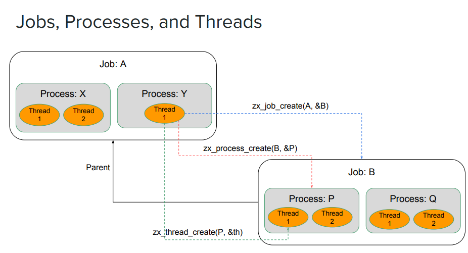

# A development of zCore sycall

## 简介

zCore是一个开源操作系统内核、使用Rust语言开发、是微内核架构、目前处于已发布阶段、可参与开发

这是其发布信息(建议阅读)  
https://zhuanlan.zhihu.com/p/137733625 

## 如何参与

目前时间处于2020年7月1日、正值暑假、同时也在如火如荼的展开着暑期OS学习活动、可参与到OS实习、学习相关内容在完成阶段一的学习后、进而参与加入到阶段二的zCore开发

当然如果本身已经对OS领域很熟悉、且对zCore感兴趣、也可直接参考issues提出的一些任务、clone下来进行补充完善、提交PR

那么接下来、简单介绍一下这次的分享、一次关于syscall的开发过程、看之前确保你对zCore或zircon有一个大概了解

## 一次syscall的开发

这次以 syscall 、 process_write_memory、process_read_memory 举例、介绍下开发过程

### 背景介绍

zcore的syscall的开发、参照了fuchsia的zircon的syscall、

使用了相同的syscall约定、目前用的也是zircon的用户测试用例

### Syscall的调用流程

1. 写一个用户程序  //TODO

2. 在用户程序中通过VDOS调用 sycall // TODO 

3. 放入 zCore    // TODO

4. 运行 程序 // TODO

5. 进入内核 // TODO

6. 处理从用户态来的syscall上下文信息函数  // TODO

7. 调用内核的syscall函数 通过上下文指定的系统调用号 来找具体syscall // TODO

8. 找到 syscall // TODO

9. 执行 // TODO

### 切面

在上述流程中、我们这次的行程 只发生在 执行 这一步、因为我们要补充好具体的syscall 、来真正供用户正确的调用、

所以先让我们来看看这此的syscall是什么

第一个 [process_read_memory](https://fuchsia.dev/fuchsia-src/reference/syscalls/process_read_memory)
```
zx_status_t zx_process_read_memory(zx_handle_t handle,
                                   zx_vaddr_t vaddr,
                                   void* buffer,
                                   size_t buffer_size,
                                   size_t* actual);
```
这是 来自 fuchsia的zircon的文档 

因为zCore参考zircon、所以我们参考 fuchsia的zircon文档

通过看文档 大致知道 (具体要参照文档、且开发时一定要参照文档、这里只是简要说明)  

process_read_memory() 尝试读取指定进程的内存  
函数的api的拥有几个参数

handle 是 指定 进程 的 句柄

vaddr 是要读取的内存块的地址

buffer 指向用户缓冲区以读取字节的指针

buffer_size 尝试读取的字节数。buffer 缓冲区必须足够大，至少要包含这么多字节  
且(0 < buffer_size <= 64m)

actual 实际读取的字节数存储在此处.如果vaddr + buffer_size超出了进程中映射的内存，则返回的字节数可能少于请求的字节数

好了、到此我们至少知道了、这个api说了点什么、但目前好像我们还不能立马就去写、

至于为什么、可以暂停在此处想一下、要去完成、需要些什么、 此处停顿几个须臾、  
考虑下 这个 syscall 什么意思  
谁调用了 这个 syscall   
谁执行了 这个 syscall  
传的参数 想表达了什么意思  

-------------------------

### 准备工作

我们了写出syscall、首先需要知道一些可以操作的东西、因为syscall本就是供用户使用系统资源的函数、

我们需要知道  内存该如何使用、指针如何使用、

因为 这个 syscall 想要做的 事情 是 读取数据 从 一个我们指定的进程中、

假设一个场景是我们在写程序、这时候我们想去一个别的应用程序里 读取数据、我们就可能用到这个syscall、

这个 syscall 被 调用 、由内核 执行 这段 代码、
就是 我们 要 填写 补充 完整的

参数也清晰的表达了这个syscall的意思、给我去用这个 handle 找到对应的process，然后从 这个process 的 
vmar 的 vaddr 这里给我把数据取出来、放进我的 buffer 里、
额外的信息 是做校验用的、以防出错

#### VM

再此我们介绍 VM(virtual memory)

分为 两大 object

VMO 和 VMAR

VMAR表示虚拟地址空间
VMO表示一块虚拟地址空间
VMMapping表示一个VMO映射到一个VMAR上面的关系
VMAR里可以有多个Mapping

举个例子、一般一个进程有一个 root VMAR 就是 没有 父节点、
这个 vmar 可以无交叉的划分出子vmar  

基本表示为 这么一张图片 


#### Task

task 是个统称 是job process 和 thread的统称

关系大概是这样子的 copy from ppt




job 负责 策略  
process 负责 资源  
thread 负责 运行计算  

在有了基本感觉后 让我们细致到代码上去看看、


### "读取"

在上面的文档里的api已经看见

其中有一个 buffer 参数 

这是一个指针、指向着用户地址空间的一块内存区域、用来传输数据

zCore里有与之相关的一个对于用户地址的封装

在 kernel-hal/src/user 下 实现对地址读写的封装

```Rust
pub type UserInPtr<T> = UserPtr<T,In>;
pub type UserOUTptr<T> = UserPtr<T,Out>;
pub type UserInOut<T> = UserPtr<T,InOut>;
```
UserIn 的 意思 是 user 给的一个地址、里面有数据、要进入内核

User --In--> Kernel  对应到 操作就是 kernel read

UserOut 相反、 

Kernel --Out--> User 对应 操作 就是 kernel write

InOut 就是 双向的 都可以 R/W


```Rust
kernel-hal/src/user 116
...
pub fn read_array(&self, len: usize) -> Result<Option<T>> {
    if len == 0 {
        return Ok(Vec::default());
    }
    self.check()?
    let mut ret = Vec::<T>::with_capacity(len);
    unsafe {
        ret.set_len(len);
        ret.as_mut_ptr().copy_from_nonoverlapping(self.ptr, len);
    }
    Ok(ret)
}
···
```

这是从用户地址按数组读取数据 相对应 还有 按数组写入数据

知道这个后 我们就可以使用 buffer 进行数据的读写

这解决了一个很实在的问题、因为我们要实现的syscall的就是 "读取指定进程的内存"

内核和用户的数据传出 所用的 方法我们知道了、也就是 "读取" 知道怎么做了、接下来再看看、这句话里的其他东西

 ### "指定进程"

task 包含三个 object 分别是 job process thread 、在上面的图中清晰的表述其关系

也说了 thread 负责 运行计算

所以在syscall的这个结构体里 存在在对当前thread的引用、

```Rust
zircon-syscall/src/lib.rs
pub struct Syscall<'a> {
    pub thread: &'a CurrentThread,
    pub thread_fn: ThreadFn,
}
```

这个 thread 是在启动程序时创建的、是个内核thread、同时也会有创建了 job 和 process

我们暂时先不去考虑 那些 、知道 当前syscall 是能 获取 当前线程的就很好、

他可以让我们 通过 thread 进去去找到 process 、因为 process 负责 资源

看 thread 结构

```Rust
zircon-object/src/thread.rs
pub struct Thread {
    base: KObjectBase,
    _counter: CountHelper,
    proc: Arc<Process>,            // <---- 是进程耶
    ext: Box<dyn Any + Send + Sync>,
    inner: Mutex<ThreadInner>,
    exceptionate: Arc<Exceptionate>,
}
``` 

process 拥有什么资源？最主要的还是空间资源

```Rust
zircon-object/src/process.rs
pub struct Process {
    base: KObjectBase,
    _counter: CountHelper,
    job: Arc<Job>,
    policy: JobPolicy,
    vmar: Arc<VmaddressRegion>,    // <----- 是虚拟地址空间耶
    ext: Box<dyn Any + Send + Sync>,
    inner: Mutex<ProcessInner>,
    exceptionate: Arc<Exceptionate>,
}
```

这样就 获取到到了 内核 的 进程

### "内存"

内存、看到他就会很高兴、因为他就是我们当前的"数据库"、真真切切的在那里、

再让我们 想一下 刚才 提到 VM时 怎么说的 

> VMAR表示虚拟地址空间  
> VMO表示一块虚拟地址空间  
> VMMapping表示一个VMO映射到一个VMAR上面的关系
> VMAR里可以有多个Mapping  

我们现在已经可以通过进程 能访问  vmar了

要看看接下来怎么做

这里说了 VMO 表示 一块虚拟内存 、vmar 只是 虚拟的地址空间、还提到了 VMMapping 

细究下VMMapping 是什么 他是表示 VMO 映射到 VMAR、那是不是意味着、VMAR 持有 VMMapping 、而VMMapping 又可以获得 VMO、

我们分别看下他们

```Rust
zircon-object/src/vmar.rs
pub struct VmAddressRegion {
    flags: VmarFlages,
    base: KObjectBase,
    _counter: CounterHelper,
    addr: VirtAddr,
    size: usize,
    parent: Option<Arc<VmAddressRegion>>,
    Page_table: Arc<Mutex<PageTable>>,
    inner: Mutex<Option<VmarInner>>,
}
``` 

似乎没有我们预料的 vmmapping、其实不是、他被装在 vmarinner里

```Rust
zircon-object/src/vmar.rs
struct VmarInner {
    children: Vec<Arc<VmAddressRegion>>,
    mappings: Vec<Arc<VmMapping>>,
}
```

这里面 有存储着 子 vmar 和 mapping

我们在看看mapping 

```Rust
zircon-object/src/vmar.rs
struct VmMapping {
    flags: MMUFlags,
    vmo： Arc<VmObject>,
    page_table: Arc<Mutex<PageTable>>,
    inner:Mutex<VmMappingInner>,
}
```

我们也看到了vmo 、 顺利的找到 可以操作 物理内存的 对象、在多看一眼 inner

```Rust
zircon-object/src/vmar.rs
struct VmMappingInner {
    addr: VirtAddr,
    size: usize,
    vmo_offset: usize,
}
```

这里记录了、这个vmo映射出来的这个mapping的信息、比如 addr 说明这个 mapping开始地址是哪里、size 是 这个 mapping 多大、 vmo_offset是这个mapping 是从他所在的vmo中偏移多少开始的

最后看下 VMO

```Rust
zircon-object/src/vmo/mod.rs
struct VmObject {
    base: KObjectBase,
    parent: Mutex<Weak<VmObject>>,
    children: Mutex<Vec<Weak<VmObject>>>,
    _counter: CounterHelper,
    resizeable: bool,
    inner: Arc<dyn VMObjectTrait>,
}
```

相信大家也猜出来了、肯定是再要看inner的、因为这个结构、比较像是一个基类

在Trait 里约定了 VMO的能力、具体实现 交给 要带上这个trait的对象 

目前我们只要关心下、 VMO有什么能力就好

```Rust
zircon-object/src/vmo/mod.rs
pub trait VMObjectTrait: Sync + Send {
    // 通过VMO的offset 读内存到 buf
    fn read(&self, offset: usize, buf: &mut [u8]) -> ZxResult;
    // 通过VMO的offset 把buf 写入 内存
    fn write(&self, offset: usize, buf: &[u8]) -> ZxResult;
    ···
}
```

okok、我觉得我们已经具备 差不多必备的能力了、可以仔细思考下、  

能不能实现 "读取指定进程的内存" 、
### 经过上述介绍、让我们来试着code下

1. 注册 syscall
1. 实现 syscall 函数
1. 运行测试用例、查看是否通过
1. 反复debug
#### 注册 syscall

首先 我们先在 zircon-syscall/src/lib.rs 里 注册上我们这个syscall

```Rust
impl Syscall<'_> {
    pub async fn syscall(&mut self, num: u32,args: [usize;8]) -> isize {
        ···一些代码
        // 这个 就是 我们 要补充 的 syscall 的 名字
        Sys::PROCESS_READ_MEMORY => {  
            // 这是 我们 实现 的 函数、函数的参数 要跟 定义类型一样、这里用...省略了、一会补充
            self.sys_process_read_memory(···) 
        }
        ···一些代码
    }
}
```

#### 实现 syscall 函数

在 zircon-syscall/src/task.rs 文件里

我们添加上 这个syscall 的实现、也就是 刚才 省略 参数 的 那个函数

```Rust
pub fn sys_process_read_memory (
    &self,                            // 这代表syscall自己
    handle_value: HandleValue,        // 这代表 用户 拥有 的 handle 用来取 存储在内核的 对应process
    vaddr: usize,                     // 文档说了 这是 要 读取的地址 在 handle 对应 的 process 的 vmar 中
    mut buffer: UserOutPtr<u8>,       // 读取到这个 buffer 里
    buffer_size: usize,               // 尝试读取的大小
    mut actual: UserOutPtr<u32>,      // 实际读取的大小
) -> ZxResult {
    let proc = self.thread.proc(); // 通过 当前线程 获取 当前进程
    
    let process = proc.get_object_with_rights::<Process>(handle_value, Rights::READ | Rights::WRITE)?;    // 通过 handle_value 取得 process 对象

    let mut data = vec![0u8;buffer_size];  // 准备个容器 用来存储 从内存 读出来的 数据
    let len = process.vmar().read_memory(vaddr,&mut data)?; // 通过指定的vaddr 把 数据读到 data中、并返回 长度、(这个就是我们补充这个syscall 要完成的主要部分)

    // 把数据 写到 buffer 中
    buffer.write_array(&addr[..len])?;
    // 把实际大小写道 actual 中
    actual.write_if_not_null(len as u32)?;

    Ok(())
    
}
```

以上是 这个 syscall 的 主体逻辑

顺便看下 read_memory的实现
```Rust
zircon-object/src/vm/vmar.rs
pub fn read_memory (&self,vaddr:usize,buf:&mut [u8]) -> ZxResult<usize> {
    let map = self.find_mapping(vaddr).ok_or(ZxError::No_MEMORY)?; // 通过 vaddr 获取 mapping
    let map_inner = map.inner.lock();  // 获取 mapping inner
    let vmo_offset = vaddr - map_inner.addr + map_inner.vmo_offset; // 计算 对vmo的offset 如果这里产生疑问、可以仔细想想
    map.vmo.read(vmo_offset,buf)?;   // 读取到buf
    Ok(buf.len()) // 返回 长度
}
```

这与我们前面的想象差不多、

我们现在 补上 syscall 注册 的 那个 参数

```Rust
impl Syscall<'_> {
    pub async fn syscall(&mut self, num: u32,args: [usize;8]) -> isize {
        
        // 这里是把参数 args数组 内容 取出来给到 变量 、这些东西是 调用syscall 传进来的参数、  
        let [a0, a1, a2, a3, a4, a5, a6, a7] = args;
        let ret = match sys_type {
            ···一些代码
            Sys::PROCESS_READ_MEMORY => {  
                // 基本类型 用 as _ 占位符 就能 推断、UserPtr 实现了 From 用 into() 推断
                self.sys_process_read_memory(a0 as _, a1 as _, a2.into(), a3 as _, a4.into()) 
            }
            ···一些代码
        }
    }
}
```

这基本上就完成了一个简单syscall的实现、当然有很多细节、并没有展开、错误检查也没有体现、是为了突出主干逻辑、

具体操作肯定还是要看代码的、

这个就是 一次 简单syscall的开发过程了、

可以按这个思路 试下 process_write_momory 

之后 参考 zcore 文档 进行 测试 、看看 是否 成功、

### 鸣谢

感谢这次开发过程中提供帮助的chyyuu老师和wangrunji0408同学  
和之前提供帮助的所有同学


